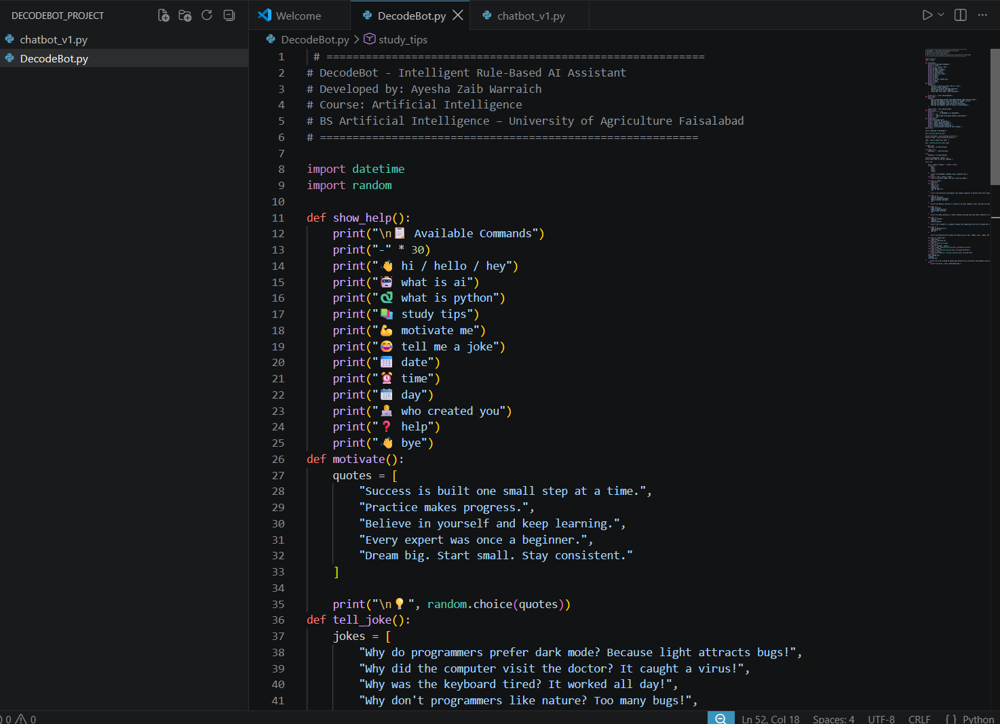
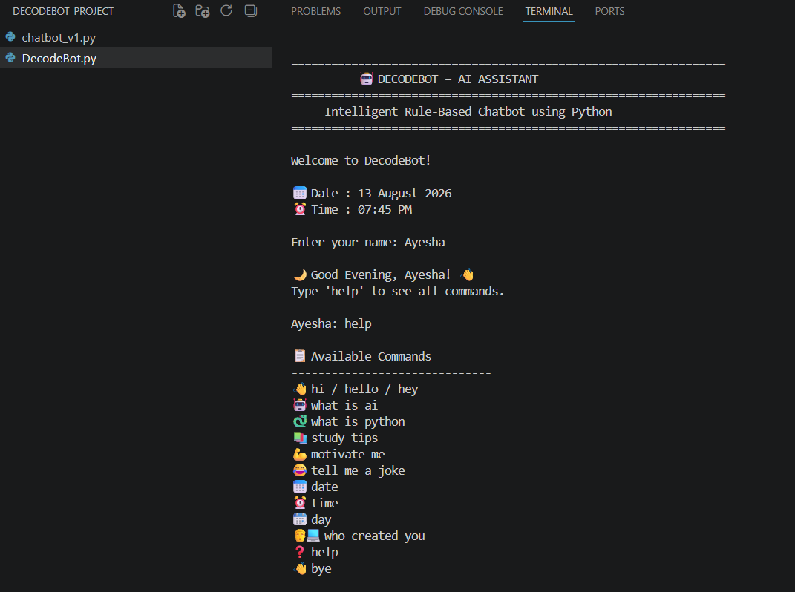
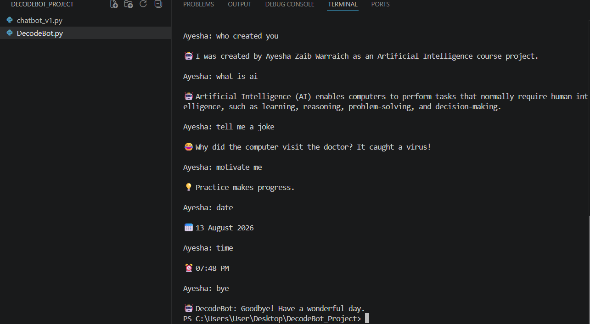

<p align="center">
  
</p>

# DecodeBot – Intelligent Rule-Based AI Assistant

> A Python-based rule-driven chatbot demonstrating Artificial Intelligence fundamentals, control flow, functions, decision-making, and interactive user communication.


---

## About the Project

**DecodeBot** is an interactive rule-based chatbot developed using **Python** as part of the **DecodeLabs Internship**.

The chatbot uses predefined rules, conditional statements, functions, loops, and user input processing to create a simple conversational experience.

Instead of relying on external AI APIs or machine learning models, DecodeBot focuses on the fundamental programming concepts behind conversational logic, control flow, and decision-making.

---

## Objectives

The main objectives of this project are to:

- Create a functional rule-based chatbot.
- Use `if-elif-else` statements for decision-making.
- Use a `while` loop for continuous interaction.
- Handle greetings and user input.
- Answer predefined questions.
- Handle multiple exit commands.
- Demonstrate functions and reusable code.
- Demonstrate control flow and decision-making.
- Apply Python programming concepts in a practical project.

---

## Features

### Core Chatbot Features

- Interactive command-line conversation
- Personalized user greeting
- Rule-based response system
- Predefined questions and responses
- Continuous conversation loop
- Multiple exit commands
- Help menu
- Unknown-input handling

### AI & Technology Topics

DecodeBot can provide information about:

- Artificial Intelligence
- Machine Learning
- Deep Learning
- Chatbots
- Generative AI
- Python

### Productivity & Entertainment

The chatbot also provides:

- Study tips
- Motivational quotes
- Random programming jokes
- Current date
- Current time
- Current day
- Creator information

---

## Available Commands

| Command | Description |
|---|---|
| `hello` | Greets the user |
| `hi` | Greets the user |
| `hey` | Greets the user |
| `help` | Displays all available commands |
| `what is ai` | Explains Artificial Intelligence |
| `define ai` | Explains Artificial Intelligence |
| `explain ai` | Explains Artificial Intelligence |
| `tell me about ai` | Explains Artificial Intelligence |
| `machine learning` | Explains Machine Learning |
| `what is machine learning` | Explains Machine Learning |
| `define machine learning` | Explains Machine Learning |
| `ml` | Explains Machine Learning |
| `deep learning` | Explains Deep Learning |
| `what is deep learning` | Explains Deep Learning |
| `define deep learning` | Explains Deep Learning |
| `dl` | Explains Deep Learning |
| `what is chatbot` | Explains what a chatbot is |
| `chatbot` | Explains what a chatbot is |
| `define chatbot` | Explains what a chatbot is |
| `generative ai` | Explains Generative AI |
| `what is generative ai` | Explains Generative AI |
| `gen ai` | Explains Generative AI |
| `study tips` | Provides study recommendations |
| `motivate me` | Displays a motivational quote |
| `tell me a joke` | Tells a random programming joke |
| `today` | Displays the current date |
| `date` | Displays the current date |
| `time` | Displays the current time |
| `day` | Displays the current day |
| `who created you` | Displays creator information |
| `creator` | Displays creator information |
| `who made you` | Displays creator information |
| `bye` | Exits the chatbot |
| `exit` | Exits the chatbot |
| `quit` | Exits the chatbot |
| `close` | Exits the chatbot |

---

## How It Works

DecodeBot follows a simple rule-based conversation process:

```text
User Input
    |
    v
Input Processing
    |
    v
Rule Matching
    |
    v
if / elif / else Decision
    |
    v
Predefined Response
    |
    v
Continue Conversation
    |
    v
Exit Command
    |
    v
End Program

## Example Interaction

```
## DecodeBot – AI Assistant

> An intelligent rule-based chatbot built with Python, designed to demonstrate fundamental Artificial Intelligence and programming concepts.                   

Welcome to DecodeBot!

Enter your name: Ayesha

Good Evening, Ayesha!
Type 'help' to see all commands.

Ayesha: what is ai

DecodeBot: Artificial Intelligence (AI) enables computers
to perform tasks that normally require human intelligence,
such as learning, reasoning, problem-solving, and decision-making.

Ayesha: machine learning

DecodeBot: Machine Learning is a branch of AI where computers
learn from data and improve their performance without being
explicitly programmed.

Ayesha: study tips

Study Tips
- Study for 45 minutes.
- Take a 10-minute break.
- Revise before sleeping.
- Practice coding every day.
- Solve problems instead of only reading.

Ayesha: tell me a joke

DecodeBot: Why do programmers prefer dark mode?
Because light attracts bugs!

Ayesha: exit

DecodeBot: Goodbye! Have a wonderful day.

---

## Learning Outcomes

Through this project, practical experience was gained in:

- Python programming fundamentals
- Conditional statements
- `if-elif-else` logic
- Loops and control flow
- Functions
- Lists
- User input processing
- String handling
- Built-in Python modules
- Rule-based decision systems
- Basic chatbot development
- Interactive command-line applications
- Git and GitHub
- Project documentation

---

## Assignment Requirements

DecodeBot fulfills the core requirements of the rule-based chatbot project:

- [x] Create a rule-based chatbot
- [x] Use `if-elif-else` statements
- [x] Handle greetings
- [x] Answer predefined questions
- [x] Handle exit commands
- [x] Run continuously until the user exits
- [x] Use functions
- [x] Process user input
- [x] Provide meaningful predefined responses

---

## Limitations

DecodeBot is intentionally designed as a **rule-based chatbot**, so it has several limitations.

It currently does not:

- Learn from conversations
- Train machine learning models
- Use external AI APIs
- Retrieve live information from the internet
- Understand unrestricted natural language
- Maintain long-term conversation memory
- Generate completely original responses dynamically

These limitations are intentional because the project focuses on understanding the fundamentals of rule-based chatbot development and Python programming.

---

## Future Improvements

Future versions of DecodeBot could be expanded with:

- Natural Language Processing
- Machine Learning-based responses
- Large Language Model integration
- Voice input and output
- Graphical User Interface
- Web-based interface
- Database integration
- Conversation history
- Personalized user profiles
- Weather API integration
- Wikipedia or knowledge APIs
- Context-aware conversations
- Improved natural-language understanding
- More advanced conversational memory

---

## Project Status

**Version 1.0 — Completed**

DecodeBot currently provides a functional command-line rule-based chatbot featuring educational, productivity, entertainment, and basic informational capabilities.

The project successfully demonstrates how fundamental Python programming concepts can be combined to build an interactive chatbot application.

---

## Internship

This project was developed as part of the **DecodeLabs Internship**.

The project represents the practical application of Python programming and Artificial Intelligence fundamentals through hands-on development.

It provided experience with:

- Problem solving
- Python development
- Rule-based AI concepts
- Control flow
- Functions
- User interaction
- Git and GitHub
- Technical documentation

---

## Author

**Ayesha Zaib Warraich**

**Degree:** BS Artificial Intelligence  
**University:** University of Agriculture Faisalabad

**Project:** DecodeBot – Intelligent Rule-Based AI Assistant  
**Internship:** DecodeLabs

---

## License

This project is licensed under the **MIT License**.

You are free to use, modify, and distribute this project according to the terms of the license.

See the [`LICENSE`](LICENSE) file for the complete license text.

---

## Acknowledgements

Special thanks to **DecodeLabs** for providing an opportunity to learn, build, and apply programming concepts through practical project development.

---

## Final Note

DecodeBot represents a practical application of Python programming and rule-based Artificial Intelligence concepts.

The project was developed with a focus on **learning, experimentation, problem-solving, and building a functional application from fundamental programming concepts**.

## 📸 Project Screenshots

### 💻 Source Code


### 🤖 Welcome Screen


### 🧪 Feature Demonstration

