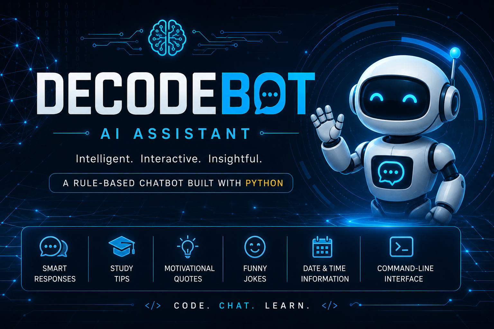

<p align="center">
  
</p>

<h1 align="center">DecodeBot</h1>

<p align="center">
  <b>Intelligent Rule-Based AI Assistant Built with Python</b>
</p>

<p align="center">
  A beginner-friendly chatbot demonstrating the fundamentals of Artificial Intelligence using Python and rule-based decision making.
</p>

<p align="center">


</p>

---

# Project Overview

DecodeBot is a rule-based AI chatbot developed entirely in Python. It interacts with users through a command-line interface and responds to predefined commands using Python's conditional statements.

Unlike machine learning chatbots, DecodeBot requires no external APIs, datasets, or internet connection. It is designed to help beginners understand the core concepts of conversational AI by implementing intelligent responses with simple programming logic.

---

# Features

- Interactive command-line chatbot
- Personalized user greetings
- Time-based welcome messages
- AI knowledge responses
- Machine Learning explanation
- Deep Learning explanation
- Generative AI explanation
- Study tips
- Motivational quotes
- Programming jokes
- Current date, time and day
- Help menu
- Multiple exit commands
- Continuous conversation loop
- Clean and modular Python code

---

# Technologies Used

| Technology | Purpose |
|------------|---------|
| Python 3 | Programming Language |
| datetime | Date & Time |
| random | Random Motivation & Jokes |

---

# Supported Commands

| Command | Description |
|---------|-------------|
| hello / hi / hey | Greeting |
| what is ai | AI Definition |
| machine learning | ML Explanation |
| deep learning | DL Explanation |
| chatbot | Chatbot Definition |
| generative ai | Generative AI |
| study tips | Study Tips |
| motivate me | Motivation |
| tell me a joke | Programming Joke |
| date | Current Date |
| time | Current Time |
| day | Current Day |
| help | List Commands |
| bye | Exit Chatbot |

---

# Project Structure

```text
DecodeBot-AI-Assistant/
│
├── DecodeBot.py
├── README.md
├── banner.png
├── LICENSE
└── .gitignore
```

---

# Installation

Clone the repository

```bash
git clone https://github.com/Ayesha-Zayb/DecodeBot-AI-Assistant.git
```

Move into the project folder

```bash
cd DecodeBot-AI-Assistant
```

Run the chatbot

```bash
python DecodeBot.py
```

---

# Example

```text
Welcome to DecodeBot!

Enter your name: Ayesha

Good Evening, Ayesha!

Ayesha: what is ai

Artificial Intelligence enables computers to perform tasks that normally require human intelligence.

Ayesha: motivate me

Believe in yourself and keep learning.

Ayesha: bye

Goodbye! Have a wonderful day.
```

---

# Python Concepts Used

- Functions
- Loops
- Conditional Statements
- Lists
- String Manipulation
- User Input
- Random Module
- Datetime Module
- Modular Programming

---

# Future Improvements

- GUI using Tkinter
- Voice Assistant
- Natural Language Processing
- Database Integration
- OpenAI API
- Flask Web Version
- Weather Information
- Wikipedia Search
- Speech Recognition

---

# Author

**Ayesha Zaib Warraich**

BS Artificial Intelligence

University of Agriculture Faisalabad

---

# License

Licensed under the MIT License.

---

<p align="center">
Made with ❤️ using Python
</p>
